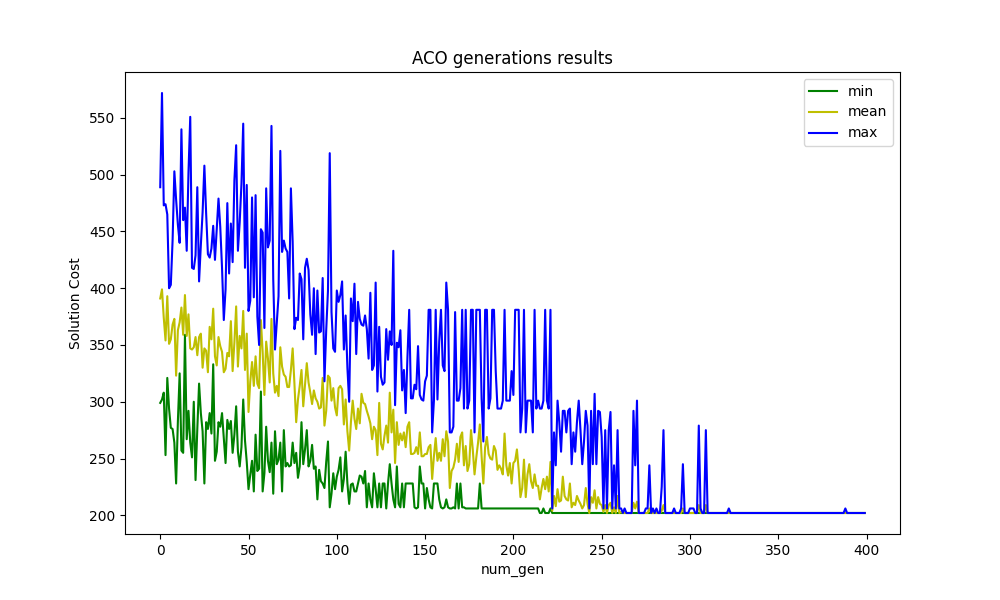
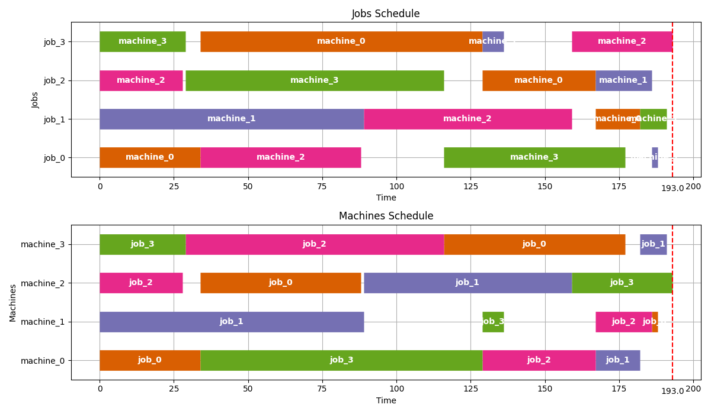

# **Open Shop Scheduling Problem via Ant Colony Optimization**
**Open-shop scheduling or open-shop scheduling problem (OSSP)** is an optimization problem in computer science and operations research. It is a variant of optimal job scheduling. In a general job-scheduling problem, we are given n jobs $J_1$, $J_2$, ..., $J_n$ of varying processing times, which need to be scheduled on m machines with varying processing power, while trying to minimize the makespan - the total length of the schedule (that is, when all the jobs have finished processing). In the specific variant known as open-shop scheduling, each job consists of a set of operations $O_1$, $O_2$, ..., $O_n$ which need to be processed in an arbitrary order. <br>
The open-shop scheduling problem can be solved in polynomial time for instances that have only two workstations or only two jobs. It may also be solved in polynomial time when all nonzero processing times are equal: in this case the problem becomes equivalent to edge coloring a bipartite graph that has the jobs and workstations as its vertices, and that has an edge for every job-workstation pair that has a nonzero processing time. The color of an edge in the coloring corresponds to the segment of time at which a job-workstation pair is scheduled to be processed. Because the line graphs of bipartite graphs are perfect graphs, bipartite graphs may be edge-colored in polynomial time. <br>
For three or more workstations, or three or more jobs, with varying processing times, open-shop scheduling is **NP-hard** (source: [wikipedia](https://en.wikipedia.org/wiki/Open-shop_scheduling)).

## **Ant Colony Optimization (ACO)**
In computer science and operations research, **the ant colony optimization algorithm (ACO) is a probabilistic technique** for solving computational problems which can be reduced to finding good paths through graphs. Artificial ants stand for multi-agent methods inspired by the behavior of real ants. The **pheromone-based** communication of biological ants is often the predominant paradigm used. Combinations of artificial ants and local search algorithms have become a method of choice for numerous optimization tasks involving some sort of graph, e.g., vehicle routing and internet routing. <br>
As an example, ant colony optimization is a class of optimization algorithms modeled on the actions of an ant colony. Artificial 'ants' (e.g. simulation agents) locate optimal solutions by moving through a parameter space representing all possible solutions. Real ants lay down pheromones directing each other to resources while exploring their environment. The simulated 'ants' similarly record their positions and the quality of their solutions, so that in later simulation iterations more ants locate better solutions (source: [wikipedia](https://en.wikipedia.org/wiki/Ant_colony_optimization_algorithms)).

For other information about ACO or Computational intelligence see [my repo about computational intelligence](https://github.com/CristianCosci/Computational_Intelligence). 

<hr>

## **Instructions for installation**
Create a dir and download the project inside.

Create a virtual env in that directory
```sh
virtualenv ACO_project
```

Activate venv to install project requirements
```sh
source ACO_project/bin/activate
```

Move to project dir and Install requiremenst
```sh
pip install -r requirements.txt
```

Now you are ready to execute and test the project.

<hr>

## **Instruction for use**
The project consists of 3 main files:
- `main.py` $\rightarrow$ file to execute to start the program
- `ACO.py` $\rightarrow$ file where the ACO optimization algorithm is implemented
- `OSSP.py` $\rightarrow$ file where the problem representation is implemented

Consequently, the file to run to start the program is `main.py`. Obviously all the files are duly commented and it is possible to easily understand how they work. However, for any clarification open a discussion and i will help you.

The various instances for the OSSP issue are available in the `test_instances` folder. <br>
In the `utils` folder instead there is a script that allows you to create ready-to-run instances by taking them from sites like [taillard istances](http://mistic.heig-vd.ch/taillard/problemes.dir/ordonnancement.dir/ordonnancement.html). <br>
It is also possible to use instances from other websites (see the description of the instances_creator.py file).

In the main directory there is also a file called `params_optimization.py` which allows to find the optimal parameters (which allow to obtain the optimal solution) for a given instance.

<hr>

### **Local Search**
In optimization problems such as OSSP, JSSP, TSP, NPP and so on, **it is customary to perform local optimization after the main optimization algorithm**. <br>
The main local optimization algorithm used in this situations is [local search](https://en.wikipedia.org/wiki/Local_search_ (optimization)). <br>
In this case i try to update the solution using a version of **local search** called: **Iterated Local Search** which uses local search in its 'best improvement' version. <br>
In case you don't get the lower bound right away using ACO, you can improve your results with this additional optimization algorithm. <br>
You can select the number of generations of the local search in a specific variable (`num_tries`) in the` main.py` file.

<hr>

### **Plot ACO results**
To **view solution improvements as generations go** by, you can print a chart showing the `minimum, average, and maximum` solution costs for each generation. <br>
To see the plot, set the appropriate variable `plot_cycles` to `True` in `main.py`.



<hr>

### **Visualize Gantt Chart**
To make it easier to evaluate the results of the optimization algorithm, it is also possible to graphically view the **gantt chart** of the found scheduling.



<hr>

### **Launch execution**
To make the operation of the code easier to interpret, everything is already set up to execute and solve an example instance with 4 machines and 4 jobs. <br> 
To start the program it is therefore sufficient to start `main.py` script with:
```sh
python3.8 main.py
```